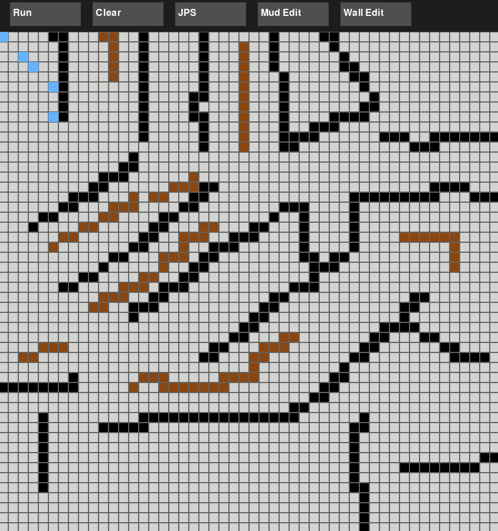

# Pathfinding Algorithm Visualizer

*Interactive grid-based pathfinding visualizer implementing Dijkstra's algorithm, A*, Bidirectional Search, and Jump Point Search (JPS) — with a real-time animated demo of each algorithm searching for the shortest path.*

## Djikstra algorithm solving a 2D grid in real time. 

## A-Star algorithm solving a 2D grid in real time. 

## Bidirectional Djikstra algorithm solving a 2D grid in real time. 

## JPS algorithm solving a 2D grid in real time. 


## Overview

This project implements and compares four pathfinding algorithms on a weighted 2D grid, with an interactive `pygame` visualizer. You can place walls and mud (variable-cost nodes) by clicking or dragging, switch between algorithms live, and watch each one search the grid step-by-step — cells light up as they're explored, before the final shortest path is drawn.

The standout piece is **Jump Point Search (JPS)** — implemented directly from the original research paper (Harabor & Grastien, 2011), including correct natural-neighbor pruning, forced-neighbor detection for both straight and diagonal movement, and the recursive jump-point identification that gives JPS its speedup over plain A*.

## Algorithms Implemented

- **Dijkstra's Algorithm** 
- **A\***
- **Bidirectional Search** — runs two Dijkstra searches simultaneously, from the start and the goal, meeting in the middle. Uses a provable stopping condition — comparing the best meeting cost found so far against the sum of both frontiers' minimum remaining costs — to guarantee the true shortest path is found, not just the first meeting point discovered.
- **Jump Point Search (JPS)** — an A\*-family optimization for uniform-cost grids that skips over long runs of "symmetric" nodes by jumping in straight or diagonal lines until it hits a wall, the goal, or a *forced neighbor*. Supports full 8-directional movement, with diagonal step costs handled correctly (`√2` per diagonal step).

All four algorithms implement a shared `PathAlgo` interface, so they're interchangeable by the visualizer (and any future benchmarking code) without any special-casing.

## Features

- **Interactive grid editor** 
- **Live algorithm switching** 
- **Real-time animated search** 
- **Clear/reset** 

## How to Run

```bash
git clone https://github.com/ShasankThapa/Path-Finding-Algorithms.git
cd Path-Finding-Algorithms
python3 -m venv .venv
source .venv/bin/activate     
pip install pygame numpy
python game_window.py
```

## Project Structure

```
PathFinder/
├── algos/
│   ├── algo_rule.py      
│   ├── Djikstra.py
│   ├── Astar.py
│   ├── Bidirect.py
│   └── JPS.py              
├── grid.py                
├── game_window.py          
└── README.md
```

## Verified Correctness

Every algorithm was manually verified against hand-traced and independently computed reference grids before being wired into the visualizer.


JPS was the hardest part of this project — implemented directly from Harabor & Grastien's 2011 paper, not a simplified guide.
This algorithm was a genuine step up from the other three, since it's composed of several smaller mechanisms working together — pruning, forced-neighbor detection, recursive jumping, and diagonal sub-scanning — rather than one single idea.
To confirm my JPS implementation was working correctly, I numerically verified its results against my already-tested A\* implementation.

## What I'd Extend Next

Add an automated `pytest` correctness tests locking in the results verified manually during development
Add statistical benchmarking across randomized maps of varying size and obstacle density
Add Heuristic admissibility experiments 
Add an additional Algo- The D* Lite for dynamic replanning when obstacles appear mid-search

## Tech Stack

Python, `pygame`, `numpy`, `heapq`
