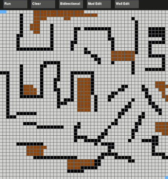

# Pathfinding Algorithm Visualizer

*Interactive grid-based pathfinding visualizer implementing Dijkstra's algorithm, A*, Bidirectional Search, and Jump Point Search (JPS) — with a real-time animated demo of each algorithm searching for the shortest path.*

## Dijkstra Algorithm solving a 2D grid in real time.


## A* Algorithm solving a 2D grid in real time.


## Bidirectional Dijkstra Algorithm solving a 2D grid in real time.


## JPS Algorithm solving a 2D grid in real time.


## Overview

This project implements and compares four pathfinding algorithms on a weighted 2D grid, with an interactive `pygame` visualizer. You can place walls and mud (variable-cost nodes) by clicking or dragging, switch between algorithms live, and watch each one search the grid step-by-step — cells light up as they're explored, before the final shortest path is drawn.

The standout piece is **Jump Point Search (JPS)** — implemented directly from the original research paper (Harabor & Grastien, 2011), including correct natural-neighbor pruning, forced-neighbor detection for both straight and diagonal movement, and the recursive jump-point identification that gives JPS its speedup over plain A*.

## Algorithms Implemented

- **Dijkstra's Algorithm** 
- **A\***
- **Bidirectional Search** — runs two Dijkstra searches simultaneously, from the start and the goal, meeting in the middle. Uses a provable stopping condition — comparing the best meeting cost found so far against the sum of both frontiers' minimum remaining costs — to guarantee the true shortest path is found, not just the first meeting point discovered.
- **Jump Point Search (JPS)** — an A\*-family optimization for uniform-cost grids that skips over long runs of "symmetric" nodes by jumping in straight or diagonal lines until it hits a wall, the goal, or a *forced neighbor*. Supports full 8-directional movement, with diagonal step costs handled correctly (`√2` per diagonal step).

All four algorithms implement a shared `PathAlgo` interface, so they're interchangeable by the visualizer (and any future benchmarking code) without any special-casing.

## Features

- **Interactive grid editor** 
- **Live algorithm switching** 
- **Real-time animated search** 
- **Clear/reset** 
- **Race mode** — several algorithms side by side on the same map (see below)

## Race Mode

Press **Race** to see four algorithms run side by side on the current map: Dijkstra, A\* (4-dir),
A\* (8-dir) and JPS. The list lives at the top of `race.py`. Press **Run** to start; every
algorithm takes the same number of search steps per frame, so they race fairly in steps
(node expansions), not wall-clock time. Each panel shows live nodes expanded, then its finishing
position and final stats. Press **Esc** or **Back** to return to editing.

**Which comparisons are fair:**

- **Dijkstra and A\* (4-dir)** solve the same problem: 4-directional movement with mud costs.
- **A\* (8-dir)** uses 8-directional movement and still pays mud costs.
- **JPS** uses 8-directional movement but assumes uniform cost: it treats mud as floor.

So the fair head-to-head is **A\* (8-dir) vs JPS on a map with no mud**, where both solve the
same 8-directional, uniform-cost problem and must find the same path cost. On a map with mud,
JPS is solving an easier problem, and its cost is marked with `*`.

A step is one node expansion. A single JPS expansion can scan many cells along a row, column or
diagonal, so JPS winning on steps doesn't mean it did less work; its panel also shows cells
scanned.

## How to Run

```bash
git clone https://github.com/ShasankThapa/Path-Finding-Algorithms.git
cd Path-Finding-Algorithms
python3 -m venv .venv
source .venv/bin/activate     
pip install -r requirements.txt
python game_window.py
```

## Project Structure

```
PathFinder/
├── algos/
│   ├── base.py            # PathAlgo base class, stats, run_to_completion()
│   ├── heuristics.py      # Manhattan and octile distance
│   ├── dijkstra.py
│   ├── astar.py
│   ├── bidirectional.py
│   └── jps.py
├── tests/                 # pytest suite with independent reference solvers
├── final-algos/           # demo GIFs
├── grid.py                # Grid costs and get_neighbours()
├── game_window.py         # main window and event loop
├── renderer.py            # all drawing
├── race.py                # race mode
├── maps_io.py             # Moving AI benchmark map and scenario loading
├── maps/                  # Moving AI .map files (and .map.scen scenarios)
├── requirements.txt
└── README.md
```

## Verified Correctness

Every algorithm was manually verified against hand-traced and independently computed reference grids before being wired into the visualizer.


JPS was the hardest part of this project — implemented directly from Harabor & Grastien's 2011 paper, not a simplified guide.
This algorithm was a genuine step up from the other three, since it's composed of several smaller mechanisms working together — pruning, forced-neighbor detection, recursive jumping, and diagonal sub-scanning — rather than one single idea.
To confirm my JPS implementation was working correctly, I numerically verified its results against my already-tested A\* implementation.

## What I'd Extend Next

Add an automated `pytest` correctness tests locking in the results verified manually during development
Add statistical benchmarking across randomized maps of varying size and obstacle density
Add Heuristic admissibility experiments 
Add an additional Algo- The D* Lite for dynamic replanning when obstacles appear mid-search

## Tech Stack

Python, `pygame`, `numpy`, `heapq`
